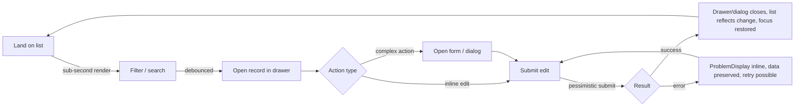
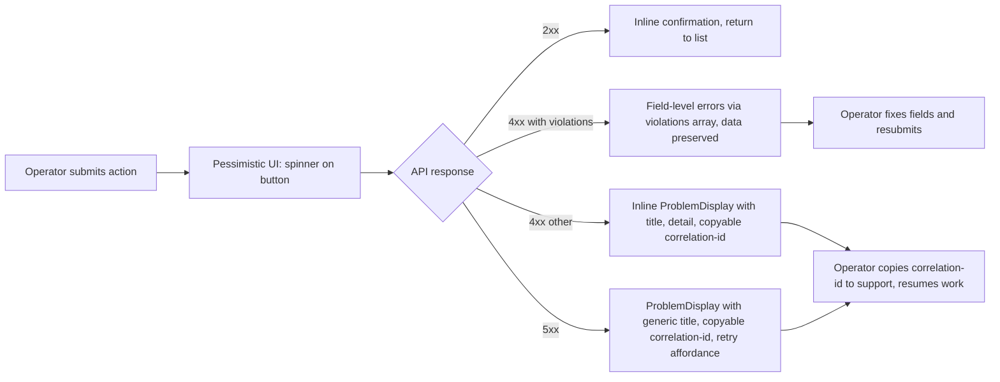
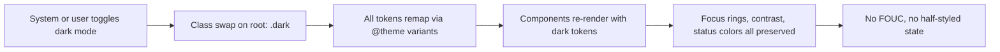

# UX Design Specification — ERPify PWA Professional Polish

**Author:** Sergio
**Date:** 2026-04-29
**Scope:** Visual & interaction polish system for the ERPify PWA — color, typography, spacing, motion, density, component states, accessibility — designed to be applied iteratively to the existing Next.js 16 + Tailwind 4 + Shadcn codebase.
**Companion artifact:** `pwa/DESIGN.md` (lean implementation-facing version generated at workflow completion).

## Executive Summary

### Project Vision

ERPify is a brownfield ERP / business platform monorepo (Symfony 8 API + Next.js 16 PWA). The PWA today is a single back-office surface (`src/app/backoffice/`) wired against two `/health` endpoints, with no brand identity and pure neutral-grayscale Shadcn defaults. **The polish system is being defined ahead of feature surface area** — its job is to make every endpoint that ships from now on feel like it was always part of one professional product, while imposing zero ceremony on the engineers building those endpoints.

The system codifies a **restrained-neutral, Linear-adjacent** visual language with one purposeful accent, encodes the just-landed **RFC 9457 Problem Details** error contract as first-class UI primitives, and ships as a tokens-first design layer in the existing Tailwind 4 `@theme` config — applied iteratively, never as a big-bang rewrite. The design *substrate* (tokens + component states + four-state async patterns) is the deliverable; full feature-level visual design follows the data shapes as they appear.

The companion artifact `pwa/DESIGN.md` is the lean implementation-facing distillation engineers consult while polishing the existing PWA.

### Target Users

> **Provisional persona — flagged for confirmation.** No persona document exists yet. The party-mode round (Mary's challenge) recommended stubbing a provisional persona explicitly so the system has an anchor without pretending the user research is settled. Day-one canon below; revise when evidence arrives.

**Primary (provisional): Finance / operations back-office operator.** Lives in the app 6+ hours per shift. Keyboard-biased; multi-tab workflow alongside spreadsheets and email. Evaluated on tickets-closed-per-hour, not delight. Comfortable with high information density. Uses a corporate-issued laptop on a slow VPN. Low tolerance for motion theater, decorative chrome, or "fun" interactions during work tasks.

**Implications for the system:**
- **Density default = compact** (≈14 px body, tight row heights). A "comfortable" density variant exists but is opt-in, not default.
- **Motion budget ≤ 200 ms**, ease-out, no spring/bounce in functional motion. `prefers-reduced-motion` honored everywhere.
- **A11y baseline = WCAG 2.2 AA**, non-negotiable: full keyboard operability, visible focus rings (must survive both light and dark mode), 4.5:1 text contrast, ≥ 24 px interactive target size, 200 % zoom usable.
- **Desktop-dense is the daily driver**, mobile-first is the responsive starting point — both must survive the same token system without a media-query forest.

**Secondary personas to anticipate but not yet design for:** warehouse supervisor (mobile/tablet, gloves, glanceable), admin/configurator (occasional power user). Acknowledged as out-of-scope until a feature drives them.

### Key Design Challenges

1. **The behavioral contract is ahead of the data contract.** The RFC 9457 error shape is fully specified (`type / title / detail / instance / correlation-id / violations[]`), but only two endpoints exist to exercise it. The polish system must encode error/empty/loading vocabulary against an envelope, not against real failures — a high risk of the visual system calcifying before realistic failure modes appear.

2. **State taxonomy ambiguity — "nothing here" has at least three different meanings.** Loading, empty, filtered-to-zero, and permission-denied all default to the same blank-card pattern unless the system explicitly distinguishes them. Without a locked taxonomy, every feature team will improvise.

3. **No persona, no brand, neutral-by-default UI.** The codebase signals "restrained-trustworthy" but doesn't *commit* to a brand voice. Decisions about accent color, typography, and tone are being made on circumstantial evidence rather than positioned brand strategy. Risk: drift the moment a stakeholder weighs in late.

4. **Density vs. mobile-first tension.** The day-one user wants compact desktop tables; the codebase rule says mobile-first; Tailwind utilities make it easy to ship two systems. The tokens must serve both **without** branching into separate component variants per breakpoint.

5. **Brownfield drift surface.** The system ships before most components exist. Without explicit governance (when to extend Shadcn vs. fork, when to add a new dep, when BEM custom classes win over utilities), each new feature team will set its own ad-hoc precedent — and "polish" will fragment by Q3.

### Design Opportunities

1. **Anchor to the contract that exists, not the data that doesn't.** Build a typed `<ProblemDisplay>` primitive that consumes the RFC 9457 envelope directly: `title` as headline, `detail` as supporting copy, `violations[]` as field-level errors, `correlation-id` as a copyable monospace chip for support handoff. Every async surface in the app inherits the same error UX from day one. **Highest single ROI move in the system.**

2. **Tokens-first as a one-PR unlock.** Color ramps with semantic aliases (`color-bg`, `color-bg-muted`, `color-text`, `color-text-muted`, `color-accent`, `color-success`, `color-warning`, `color-danger`, `color-focus`), type scale, spacing scale, radius scale, motion durations and easings — all in `globals.css` `@theme`. One PR, no component changes, every downstream component picks them up automatically. Both light and dark modes ship in the same PR.

3. **Lock the four-state async pattern (idle → loading → empty → error) as a core primitive.** Each state has prescribed copy slots, an icon, and an affordance. Loading is **skeleton for layout-stable surfaces, spinner for actions, progress for known-duration** — the rule is named once, applied everywhere. Empty distinguishes first-run vs. filtered-to-zero vs. permission-denied via copy and icon variants.

4. **One restrained accent, used with intent.** Pick a single oklch hue (Sally's recommendation: desaturated teal or indigo at L≈0.55, C≈0.12), use it only for primary action and active state. Everything else stays neutral. This is the cheapest, highest-impact identity move available — and it's reversible.

5. **Pessimistic-by-default async, opt-in optimism.** With Doctrine + Messenger workers + audit table on the API side, optimistic updates can mislead users about state. Default to pessimistic update + skeleton; introduce optimistic UI only per-action where the latency is visible and the rollback story is designed.

6. **Governance as part of the design system, not separate from it.** The `pwa/DESIGN.md` companion includes an explicit "when to extend Shadcn / when new deps are okay / when BEM custom classes win" decision section, so future feature teams have a precedent to point at instead of inventing one.

### Round Decisions Locked

- **Persona**: provisional finance/ops back-office operator, labeled provisional in DESIGN.md.
- **Tone**: restrained-neutral, Linear-adjacent. One purposeful accent.
- **Sequence**: tokens → component states → four-state async pattern → forms → data-density (deferred until first real listing endpoint) → nav → motion (last).
- **Dependency policy**: `class-variance-authority` is implicitly approved (Shadcn already pulls it in); virtualized table, date picker, and charts are deferred-with-explicit-approval-required, not auto-included; everything else holds the no-new-deps line.
- **PWA-first re-scoped**: deployment target name only. Mobile-first responsive stays; offline/installable/service-worker is **not** a back-office requirement and is out-of-scope until a feature drives it.
- **Tables**: token-level table styles ship in Phase 1 (row density, header treatment, zebra, focus); rich data-grid patterns (sorting, virtualization, bulk actions) deferred to first real listing endpoint per Winston's mitigation.

## Core User Experience

### Defining Experience

ERPify back-office is a CRUD-heavy operator tool, not a single-feature product. There is no one canonical "primary action" — there is a **canonical interaction loop** that the polish system optimizes:

> **scan → filter → open → act → confirm → return**

The operator lands on a list, narrows by saved view or filter, opens one record, takes a typed action (edit, approve, transition, delete, link), receives confirmation, and returns to the list. Most of the operator's tickets-per-hour is decided in the *return* path: did the list re-sort sensibly, did focus land somewhere predictable, did the action survive a slow API without making the operator second-guess what just happened.

**The polish system codifies this loop as the substrate; every feature surface inherits it.** Net effect: a new bounded context can ship a list + record + action set on day one and feel native to ERPify, without re-litigating density, focus management, error rendering, or empty-state copy.

### Platform Strategy

- **Primary platform:** web, desktop-first dense default, modern Chromium / Firefox / Safari (no IE / legacy Edge).
- **Responsive support:** mobile and tablet supported through the same token set and component primitives — no parallel components or branching variants per breakpoint.
- **Input model:** **keyboard-first.** Every interactive element is keyboard-reachable; focus rings visible in both light and dark mode; `Tab` order matches visual order; `Esc` closes overlays; `Enter` confirms primary actions; `/` reserved for in-page search where applicable; `Cmd/Ctrl+K` reserved for a future command palette. Mouse and touch are first-class but never required to complete a task.
- **Explicitly out of scope:** offline mode, service-worker installation, push notifications, native packaging. "PWA" is the deployment-target name, not a feature surface. Re-evaluate when a feature drives it.
- **Performance budget:** TTI ≤ 2 s on a VPN-throttled corporate laptop. Any loading state must appear within 100 ms of intent or be skipped (treat as instant).

### Effortless Interactions

The polish system guarantees these so feature teams don't reinvent them per surface:

1. **Keyboard works everywhere.** Every interactive element reachable; focus state visible; `Esc` closes overlays; `Enter` confirms primary action; focus restores predictably after a dialog or drawer closes.
2. **State transitions are honest.** Pessimistic by default — if the API is working, the UI shows "working"; if it succeeded, the UI shows "done"; if it failed, the UI surfaces exactly what RFC 9457 returned and never silently swallows. No misleading optimistic flashes.
3. **Errors recover in place.** Field-level violations attach to the field (no toast for a form error). The submit button stays enabled with the user's data preserved. The user never re-types.
4. **Loading is layout-stable.** Skeletons match the eventual layout; spinners appear only on action buttons; progress is reserved for known-duration operations. The page does not reflow once data arrives.
5. **Correlation IDs are one click away.** When something goes wrong, the operator hands a single copyable string to support and the trail is recoverable end-to-end (per the API PRD's Priya / oncall journey).

### Critical Success Moments

1. **First sub-second list render** in the correct dense table tokens — the operator's first impression of "this is paid-for."
2. **First successful form submit** where validation errors round-trip cleanly through `violations[]` into field-level inline messages — proves the error contract is real.
3. **First failed action** where the operator pastes a `correlation-id` to support and oncall closes the loop in under 60 s (matches the API PRD's stated success metric).
4. **First keyboard-only walk-through** of an end-to-end task — no mouse touched. Proves the keyboard-canon principle.
5. **First dark-mode session** that does not feel like a half-finished port — focus rings visible, contrast preserved, no flash-of-wrong-palette on hydration.

### Experience Principles

The six principles below govern every UX decision in the polish system. Where they conflict with a stylistic preference, they win.

1. **Honest over delightful.** The system never lies to save the user a feeling. Pessimistic defaults, exact RFC 9457 error rendering, no optimistic theater. The operator's trust compounds over a workday; misdirection corrodes it.
2. **Quiet by default, loud only on signal.** No decorative motion, no decorative color, no decorative copy. Color, motion, and emphasis are reserved tokens — when they appear, they carry meaning the operator can rely on.
3. **Density is a feature.** The default density fits more on the screen, not less. Comfortable density is opt-in; compact density is the norm. Whitespace is earned, not granted.
4. **Keyboard is the canonical input.** Mouse and touch are first-class but secondary. Keyboard support is a hard requirement on every primitive, not a fallback path bolted on at the end.
5. **One way to do each thing.** A single skeleton pattern, a single error pattern, a single empty pattern, a single primary-action color, a single elevation scale. Where Shadcn or Tailwind offers many, the system picks one and forbids the rest in custom code.
6. **Brownfield-safe iteration.** Every token and every primitive can be applied to one component at a time without breaking the rest. No flag-day rewrites. The system gets adopted by attrition; that is a feature, not a workaround.

## Desired Emotional Response

### Primary Emotional Goals

ERPify back-office is not designed to delight; it is designed to **earn trust over a workday**. Operators do not log in to feel something — they log in to close tickets, reconcile records, and finish work that someone else is waiting on. The polish system targets a tight emotional band:

- **Calm competence** (primary). The product feels like a tool that respects the operator's attention, holds its shape under load, and never theatrically performs work that hasn't happened.
- **Quiet confidence** (secondary). When the operator commits an action, the product responds with the smallest possible amount of feedback that proves it understood — no celebratory animation, no toast pile-up, no "Awesome!" copy.
- **Recoverable safety** (secondary). When something fails, the operator feels caught, not blamed. The product hands back the data, the field-level reasons, and the support handle (`correlation-id`) without ceremony.

### Emotional Journey Mapping

| Loop phase | Target feeling | What earns it |
|---|---|---|
| **Scan** (land on a list) | "I can find what I need" | Sub-second render, dense default, sticky header, keyboard-reachable filters |
| **Filter** | "The product is keeping up with me" | Instant local filter, debounced server filter, no layout shift when results arrive |
| **Open** (drill into a record) | "I am still oriented" | Predictable transition, breadcrumb, focus lands on the record's primary affordance, `Esc` returns |
| **Act** (submit a change) | "I am committed but not gambling" | Pessimistic submit, button shows a spinner, button stays in place, no premature success state |
| **Confirm** | "It is done" | Success surface for ≤ 2 s, then quiet; record reflects the new state inline |
| **Return** (back to list) | "I haven't lost my place" | List re-renders with the changed row in place, focus restores to the row, scroll position preserved |
| **Recover** (after an error) | "I know what to do next" | RFC 9457 `title` on top, `detail` underneath, `violations[]` attached to fields, `correlation-id` copyable, data preserved |

### Micro-Emotions

- **Trust** in a `correlation-id` chip: tiny, monospace, one-click copy, always present in error UI.
- **Relief** in a preserved form: the product never makes the operator re-type after a server error.
- **Pride** in keyboard fluency: Tab, Enter, Esc form a complete vocabulary; advanced operators feel rewarded.
- **Recognition** in dark mode: the focus ring, contrast, and selection states feel intentionally crafted, not retrofitted.

### Design Implications

- **No celebratory animation.** Confirmation is conveyed by state change, not by a bouncing checkmark.
- **No toast pile-up.** Errors stay inline with the action that triggered them; toasts are reserved for ambient events the operator did not initiate.
- **Copy is operational, not aspirational.** "Saved" beats "Great job!" Every time. Microcopy in `pwa/DESIGN.md` is a hard rule, not a guideline.
- **Failure is a designed surface, not a fallback.** Error UI is a first-class primitive — see `<ProblemDisplay>` in component strategy.

### Emotional Design Principles

1. **Calm beats clever.** Any element that reads as "fun" or "personality" is the wrong element on this product.
2. **Earn trust through honesty.** No optimistic flashes, no swallowed errors, no misleading copy. Trust accrues from the product never lying.
3. **Recovery is part of the experience, not the failure path.** The error surface is designed to the same fidelity as the success surface.
4. **Reward fluency.** The longer an operator uses the product, the more they should feel rewarded by keyboard shortcuts, predictable focus, and dense layouts.
5. **No emotional debt.** The product never asks the operator to feel something — gratitude, excitement, urgency — that the operator did not bring with them.

## UX Pattern Analysis & Inspiration

### Inspiring Products Analysis

| Product | What we steal | What we leave |
|---|---|---|
| **Linear** | Restrained palette with one accent, dense default, keyboard-first, command palette grammar (later), fast transitions, monospace for IDs | Issue-tracker-specific affordances, opinionated data model display, animated state cycling |
| **Stripe Dashboard** | Information density without claustrophobia, typographic hierarchy on data tables, error-first thinking (developer-grade error display), subtle elevation discipline | Marketing-product polish on every chrome surface, branded blue (we want our own restrained accent), stripe-specific table affordances |
| **Vercel Dashboard** | Dark mode parity, monospace selectively for system identifiers, refined empty states, build-status-as-first-class-primitive (analog: our async-state-as-first-class-primitive) | Decorative gradients, marketing-adjacent copy, brand-forward color usage |
| **Notion** (selectively) | Slash-menu pattern (consideration for command palette later), inline edit affordances on rows | Warm palette, decorative iconography, "fun" microcopy, page-as-primary-document model — wrong for ERP |
| **Cal.com / Plain** | Minimal chrome, content-as-hero, one-accent discipline, modal-as-drawer pattern for detail-from-list | Consumer-product warmth, brand-color-as-primary |

### Transferable UX Patterns

1. **Single-accent restraint** (Linear / Stripe / Vercel): one hue used for primary action, active state, focus accent — nothing else.
2. **Detail-from-list as drawer or modal, not navigation** (Linear / Notion): keep the list context visible; never make the operator lose their place to read a record.
3. **Inline edit on the record where safe** (Notion / Linear): edit-in-place for low-stakes fields; full form for complex changes.
4. **Monospace for identifiers** (Stripe / Vercel / Linear): UUIDs, correlation IDs, codes, hash-shaped values get monospace and a subtle background.
5. **Keyboard shortcut hints in the UI** (Linear / Notion): show the shortcut next to the action label so the operator learns by exposure.
6. **Dense table headers with sortable affordances** (Linear / Stripe): one-line headers, sort-direction caret, hover state.
7. **Skeleton-shaped-like-the-result** (Vercel / Stripe): skeletons match the eventual layout exactly so there is no reflow.

### Anti-Patterns to Avoid

- **SAP / Oracle Fusion / NetSuite chrome** — heavy frames, primary-blue gradients, deep nested menus, modal stacks. Reads as "procurement chose me."
- **Salesforce Lightning over-iconification** — every action with an icon dilutes meaning. Icons are reserved tokens.
- **Material Design ripple effects and elevated card stacking** — too playful, signals consumer product.
- **Decorative empty-state illustrations** — every empty state with a cute drawing wastes pixels and trains the operator to ignore the empty state. Use a small icon + clear copy + the recovery action.
- **Toast notifications for action confirmation** — confirmation belongs to the action's surface, not floating chrome.
- **Optimistic UI with silent rollback** — operator commits, sees success, sees value re-flicker to old, mistrust accrues forever.
- **Multi-color status badges with redundant icons** — a single-glyph status badge with semantic color is enough.
- **Sticky banner stacks** — ERP UIs love these; they steal vertical space the operator needs.

### Design Inspiration Strategy

- **Reference set:** Linear (primary), Stripe Dashboard (information density), Vercel (dark mode, monospace identifiers), Plain (chrome restraint).
- **Calibration:** when a polish decision is contested, the question is "what would Linear do, given an ERP back-office's density requirements." Linear is the spirit; Stripe density is the body.
- **Forbidden references:** SAP, Oracle Fusion, NetSuite, Salesforce Lightning, generic Material implementations. If a pattern's only home is enterprise-blue, it's not an ERPify pattern.
- **Originality vs. familiarity:** prefer familiar over original. Operators come pre-trained on patterns from the reference set; do not invent a new gesture vocabulary.

## Design System Foundation

### Design System Choice

**Shadcn UI primitives + Tailwind 4 `@theme` tokens, both unforked, extended via composition.**

- Shadcn primitives are the base layer (`Button`, `Input`, `Dialog`, `DropdownMenu`, `Tooltip`, `Select`, `Checkbox`, `Toast`, etc.). They live in `pwa/src/components/ui/` and are not modified upstream.
- Tailwind 4 `@theme` block in `pwa/src/app/globals.css` is the single source of design tokens. Every color, radius, spacing, typography, motion duration, and shadow is named there.
- ERPify-specific composite components (`<ProblemDisplay>`, `<AsyncBoundary>`, `<DataTable>`, `<FormField>`, `<RecordSheet>`) live in `pwa/src/components/erpify/` and are built from Shadcn primitives + tokens. They are forkable; Shadcn primitives are not.

### Rationale for Selection

- **Shadcn is already installed and used in the codebase.** The cheapest professional-quality decision.
- **Unforked is non-negotiable** (Winston, party round): forking restarts the upgrade treadmill. Composition over modification.
- **Tailwind 4 CSS-first `@theme` is the project's authoritative styling layer.** A second design framework (CSS-in-JS, Stitches, Panda) would fight the existing system.
- **No new dependencies** matches the locked stack constraint. CVA is implicitly approved (Shadcn already pulls it in).
- **The tokens layer survives a Shadcn version bump** because tokens are local and primitive. Shadcn upgrades touch primitives; ERPify composites touch tokens.

### Implementation Approach

- **Phase 1 — Tokens only.** Replace neutral grayscale defaults in `globals.css` `@theme` with the ERPify ramp. Add semantic aliases (`--color-bg`, `--color-bg-muted`, `--color-text`, `--color-text-muted`, `--color-accent`, `--color-success`, `--color-warning`, `--color-danger`, `--color-focus`). Both light and dark mode in the same PR. Zero component changes.
- **Phase 2 — Shadcn primitives consume tokens.** Audit each primitive's CSS variable references; ensure they point to ERPify semantic tokens, not raw values.
- **Phase 3 — ERPify composites.** Build the named composites (`<ProblemDisplay>`, `<AsyncBoundary>`, `<DataTable>`, `<FormField>`, `<RecordSheet>`) on top of Shadcn primitives.
- **Phase 4 — Pattern adoption.** Feature teams use ERPify composites. Linter rule (long-term) flags raw Shadcn primitive use where a composite exists.

### Customization Strategy

- **Token overrides in `@theme`** for ERPify identity (palette, accent, type scale, motion).
- **CVA variants** for size, density, and intent on ERPify composites.
- **Slot-based composition** (Radix-style, already the Shadcn pattern) for composites that need flexible content — never fork the primitive.
- **`cn()` (clsx + tailwind-merge)** for class composition; never string concat.
- **No CSS-in-JS, no styled-components, no Panda, no Stitches.** Tailwind utilities + tokens are sufficient.
- **BEM custom classes** are reserved for genuinely component-shaped CSS that utilities cannot express cleanly (typically: complex pseudo-element decoration, rare). Default is utility classes.

## 2. Core User Experience

### 2.1 Defining Experience

See **Core User Experience → Defining Experience** above. Canonical loop: **scan → filter → open → act → confirm → return**.

### 2.2 User Mental Model

The operator's mental model is **records-and-actions**, not pages-and-flows:

- A **record** is the fundamental object (a customer, an invoice, a line item). It has a stable identity (UUID), a status, and a set of fields.
- An **action** is something the operator does to a record (edit, transition, link, archive, approve). It has a verb name and a typed effect.
- A **view** is a filtered, sorted, paginated set of records. Views are saveable (later); ad-hoc filters are persistent within a session.
- The operator thinks "I have a list of X, I am narrowing to a subset, I will act on each, and then return to the next." The polish system never breaks that mental loop with a wizard, multi-step flow, or page navigation that loses context.

**Implication for design:** detail-from-list is a drawer or modal where possible (preserves list context), full-page navigation is reserved for cross-record workflows that genuinely change the operator's mental scope.

### 2.3 Success Criteria

- Time from list-render to first record-opened: ≤ 3 seconds for an experienced operator.
- Keyboard-only path through scan → filter → open → act → confirm → return: 100 % feasible on every feature surface.
- Recovery from a server error to a re-submitted action: ≤ 10 seconds with no data re-entry.
- First-time operator can identify the four async states (idle, loading, empty, error) on a screen they have never seen before.

### 2.4 Novel UX Patterns

The polish system explicitly rejects novelty. There are two patterns it formalizes that are uncommon in ERP UIs:

1. **`<ProblemDisplay>` as a typed primitive consuming RFC 9457 directly.** Most ERP UIs invent their own error envelope. ERPify's UI consumes the API contract verbatim.
2. **Four-state `<AsyncBoundary>` (idle / loading / empty / error) as the canonical async surface wrapper.** Most React apps inline these states inconsistently per component. ERPify wraps every async surface in one primitive that enforces the taxonomy.

Everything else in the system is intentionally familiar.

### 2.5 Experience Mechanics

- **Focus management:** every modal/drawer captures focus on open, restores focus on close. Lists restore focus to the row that triggered the open.
- **Optimistic vs pessimistic:** **pessimistic by default.** Optimistic UI is opt-in per action and requires a designed rollback path documented alongside.
- **Toast lifecycle:** ambient events only (background sync done, mention received later, etc.). Never used for confirmation of an operator-initiated action. Toasts are dismissable, auto-clear in 5 s, stack max 3 (oldest dismissed).
- **Dialog vs drawer vs full page:** dialog for confirmation (≤ 2 fields), drawer for inline detail/edit (≤ 1 record's worth), full page for cross-record workflows.
- **Keyboard vocabulary:** `Tab` / `Shift+Tab` (focus), `Enter` (primary action), `Esc` (dismiss/cancel), `/` (focus in-page search where applicable), `Cmd/Ctrl+K` (reserved for command palette).
- **Sort/filter/paginate:** sort and filter via list header controls; pagination via cursor (matches API capability) — keyset pagination, never `OFFSET`.

## Visual Design Foundation

### Color System

**Palette = neutral grayscale + one purposeful accent + three semantic signals. Defined in `oklch()` for perceptual uniformity. Light and dark modes both ship.**

#### Neutral ramp (12 stops)

`--color-neutral-{50, 100, 200, 300, 400, 500, 600, 700, 800, 900, 950, 1000}` — chroma 0, lightness from `0.985` (50) down to `0.05` (1000). Used for all surfaces, borders, dividers, and text.

#### Accent (single hue)

`--color-accent-{50…900}` — provisional choice: **oklch indigo** at hue ≈ 264, peak chroma ≈ 0.13, peak lightness ≈ 0.55. Locked to one hue ramp; no rainbow, no chart-color sprawl. Used for: primary action background, active nav state, focus ring accent, link.

> **Provisional pending stakeholder confirmation.** Final hue selection between desaturated-indigo and desaturated-teal can be deferred and applied as a token-only change.

#### Semantic signals

- `--color-success` ≈ oklch(0.62 0.13 145) (green, low chroma)
- `--color-warning` ≈ oklch(0.74 0.14 75) (amber, low chroma)
- `--color-danger` ≈ oklch(0.55 0.20 27) (red, slightly higher chroma — danger earns its volume)
- `--color-info` = `--color-accent-500`

Each has a `-bg`, `-fg`, `-border` semantic alias. Never use the raw ramp value in components — always the alias.

#### Semantic aliases (the contract components consume)

```
--color-bg
--color-bg-muted
--color-bg-subtle
--color-bg-elevated
--color-text
--color-text-muted
--color-text-subtle
--color-text-on-accent
--color-border
--color-border-strong
--color-focus-ring
--color-accent
--color-accent-hover
--color-accent-active
--color-success-bg --color-success-fg --color-success-border
--color-warning-bg --color-warning-fg --color-warning-border
--color-danger-bg  --color-danger-fg  --color-danger-border
```

Light and dark modes assign different ramp stops to the same alias. Components never know which mode they are in.

#### Contrast minimums

- Body text on background: ≥ 4.5:1 (WCAG AA).
- Large text (≥ 18 px) on background: ≥ 3:1.
- UI controls (focus ring, active border): ≥ 3:1 against adjacent surfaces.
- Disabled text: 3:1 minimum (we deliberately exceed the WCAG carve-out for disabled states because operators read disabled fields all day).

### Typography System

- **Font family:** system stack (`ui-sans-serif, system-ui, -apple-system, BlinkMacSystemFont, …`). No web fonts in v1 — perceived performance over identity. Optional later: Inter as an opt-in token override.
- **Monospace:** `ui-monospace, SFMono-Regular, "SF Mono", Menlo, Consolas, monospace`. Used for: identifiers (UUIDs, correlation IDs, codes), numeric tabular data, code/JSON inline.
- **Type scale (modular, 1.125 ratio, anchored at 14 px body):**
  - `--text-2xs` 11 px (chips, tabular metadata)
  - `--text-xs` 12 px (table headers, secondary metadata, dense forms)
  - `--text-sm` 13 px (default secondary)
  - `--text-base` 14 px (**body default — dense by design**)
  - `--text-md` 16 px (comfortable density opt-in)
  - `--text-lg` 18 px (section heading)
  - `--text-xl` 20 px (page heading L2)
  - `--text-2xl` 24 px (page heading L1)
  - `--text-3xl` 30 px (rare — empty-state hero)
- **Line heights:** 1.4 for body, 1.25 for headings, 1.6 for prose blocks. Tabular numbers use `font-variant-numeric: tabular-nums`.
- **Weights:** 400 regular, 500 medium (data emphasis, button label), 600 semibold (headings, primary buttons). No 700+ — too loud.
- **Tracking:** −0.01em on headings ≥ 18 px; default elsewhere.

### Spacing & Layout Foundation

- **Base unit:** 4 px. Scale: 0, 1 (4), 2 (8), 3 (12), 4 (16), 5 (20), 6 (24), 8 (32), 10 (40), 12 (48), 16 (64), 20 (80), 24 (96).
- **Component density rules:**
  - Compact (default): button height 32 px, input height 32 px, table row 36 px, list row 40 px.
  - Comfortable (opt-in): button 36, input 36, table row 44, list row 48.
- **Radii:** `--radius-sm` 4 px, `--radius-md` 6 px, `--radius-lg` 8 px, `--radius-xl` 12 px, `--radius-full` 9999. Default control radius: `--radius-md`. Table cells stay sharp (no radius) for visual density.
- **Elevation (shadows):** four-stop scale.
  - `--elevation-0` none (default)
  - `--elevation-1` 0 1px 2px / 0.06 (resting card)
  - `--elevation-2` 0 4px 8px / 0.08 (popover, dropdown)
  - `--elevation-3` 0 8px 16px / 0.10 (dialog)
  - `--elevation-4` 0 16px 32px / 0.12 (drawer / sheet)
  - Dark mode reduces opacity to 0.40–0.55 on the same alpha values.
- **Container widths:** sidebar 240 px (collapsible 56 px), main content `min(1440px, 100% − sidebar)`. Forms max-width 720 px; data tables fill available width.
- **Grid:** 12-column at desktop (`≥ 1024 px`); single column on mobile (`< 640 px`); intermediate: 6-column at tablet.
- **Motion durations:**
  - `--duration-instant` 0 ms (operator-initiated state change)
  - `--duration-fast` 120 ms (hover, micro-feedback)
  - `--duration-base` 180 ms (modal/drawer enter/exit)
  - `--duration-slow` 240 ms (page-level transition — rare)
  - All easings: `cubic-bezier(0.16, 1, 0.3, 1)` (ease-out, no bounce).
- **`prefers-reduced-motion`:** every motion token collapses to `0 ms` when the media query matches; transitions become opacity swaps only.

### Accessibility Considerations

- **Focus visibility:** every interactive element shows a 2 px focus ring using `--color-focus-ring`, offset 2 px from the element's outer edge. Ring is visible in both light and dark mode.
- **Hit targets:** minimum 24 × 24 px for any interactive element; 44 × 44 px on touch contexts (mobile breakpoint).
- **Color is never the sole signal.** Status, validation, and selection always carry an icon, label, or position cue alongside color.
- **Reduced motion respected** via `@media (prefers-reduced-motion: reduce)` and the motion-token collapse described above.
- **Keyboard trap prevention:** modal/drawer focus traps must release on `Esc` and on close-button activation; never lock focus indefinitely.
- **Live regions:** form validation errors announced via `aria-live="polite"`; system errors via `aria-live="assertive"`.
- **Form labels are mandatory.** No placeholder-as-label. Every input has an explicit `<label>`.

## Design Direction Decision

### Design Directions Explored

Three directions were considered in the discovery round:

1. **Restrained-neutral, Linear-adjacent** — neutral grayscale + one accent, dense default, system font, minimal motion.
2. **Enterprise-trustworthy, Salesforce/SAP-blue** — primary blue chrome, branded surfaces, formal density.
3. **Warm-modern, Notion-style** — warm-leaning neutrals, generous whitespace, soft accents, rounded everything.

### Chosen Direction

**Restrained-neutral, Linear-adjacent.**

### Design Rationale

- **Codebase signal.** The current PWA already uses neutral grayscale, Shadcn unforked, no chroma. Going Linear-adjacent is the smallest gradient from current state to professional polish.
- **User signal.** Provisional persona (back-office operator, 6+ hours/day, keyboard-biased) wants density and quiet — exactly what restrained-neutral delivers and exactly what enterprise-blue and warm-modern dilute.
- **Engineering signal.** Tokens-first, Shadcn-unforked, no-new-deps all line up with restrained-neutral. Enterprise-blue typically requires more chrome and elevation (more code); warm-modern requires custom typography and decorative iconography (more dependencies and assets).
- **Positioning signal.** ERPify is brownfield-early-stage; a memorable identity comes later from product, not from chrome. Restrained-neutral keeps that door open.

### Implementation Approach

- Phase 1: tokens-only PR (light + dark) replacing the current grayscale defaults with the ERPify ramp + accent + semantic aliases.
- Phase 2: audit Shadcn primitive variable references; align with semantic aliases.
- Phase 3: ERPify composites (`<ProblemDisplay>`, `<AsyncBoundary>`, `<DataTable>`, `<FormField>`, `<RecordSheet>`).
- Phase 4: pattern adoption per feature team; lint rule encourages composites over raw primitives where one exists.

The visual identity is reversible: a future stakeholder decision to shift accent hue or pick a brand color is a token-file change with no component impact.

## User Journey Flows

### Journey 1 — Operator closes a ticket (canonical loop)



### Journey 2 — Operator hits a server error



### Journey 3 — Operator navigates dark mode



### Journey Patterns

- **Action commits return focus to triggering element.** A drawer-opened-from-row closes back to that row with focus restored.
- **List preserves scroll position across drill-down and back.** The operator never re-scrolls.
- **Errors stay where the action was attempted.** No navigation away to an error page; no toast-as-error.
- **Dark mode is fully tokenized.** No component-level dark-mode logic; tokens carry the dark variant.

### Flow Optimization Principles

1. **Optimize the return path, not the entry path.** Operators do the loop hundreds of times per shift — the return is where lost seconds compound.
2. **Preserve operator state ruthlessly.** Scroll, focus, filter, partial form data — preserved across drill-downs, navigation, and recoverable errors.
3. **Latency is a design surface.** Sub-100 ms responses are instant (no spinner). 100 ms – 1 s gets a button-spinner. > 1 s gets a skeleton or progress.
4. **Errors are designed flows, not exits.** Every error state has a documented recovery path that returns the operator to the loop.
5. **Keyboard paths are first-class flows, not afterthoughts.** Every journey is walkable without a mouse.

## Component Strategy

> **Spec discipline:** primitives below are the ERPify-specific composite layer. Shadcn primitives (`Button`, `Input`, `Dialog`, `Toast`, `DropdownMenu`, `Tooltip`, `Select`, `Checkbox`, `RadioGroup`, `Switch`, `Tabs`, `Accordion`, `Avatar`, `Badge`, `Separator`, `Skeleton`, `ScrollArea`, `Popover`, `Sheet`, `Command`) are consumed unforked and not specified here — see Shadcn docs.

### `<ProblemDisplay>`

**Purpose:** render an RFC 9457 Problem Details object as a uniform, accessible, recoverable error surface across every feature.
**Usage:** anywhere an API error is displayed inline (form submission failure, list load failure, action failure).
**Anatomy:** icon (semantic, danger or warning) · title (RFC `title`) · detail (RFC `detail`, when present) · violations list (RFC `violations[]`, when present, attached to fields where possible) · correlation-id chip (copyable, monospace, small) · primary recovery action (retry / dismiss / contact).
**States:** inline (within a form/list), full-surface (replaces a panel when the entire surface failed to load), compact (within a row).
**Variants:** `inline` (default), `panel`, `compact`. CVA-driven.
**Accessibility:** `role="alert"`, `aria-live="assertive"` for action errors; `aria-live="polite"` for ambient. Correlation-id chip has copy button with `aria-label="Copy correlation ID"`.
**Content guidelines:** `title` shown verbatim from API. Never mutate `title` client-side. `detail` rendered as plain text. `violations` rendered as a list with field labels resolved from form context.
**Interaction behavior:** correlation-id chip copies to clipboard on click and shows a 2-second "copied" affordance. Retry triggers parent component's retry callback.

### `<AsyncBoundary>`

**Purpose:** wrap any async surface and guarantee one of four explicit states (idle, loading, empty, error) renders consistently.
**Usage:** wraps a list, a record detail, a chart, a stat panel — any component that depends on async data.
**Anatomy:** four slots (`idle`, `loading`, `empty`, `error`) with sensible defaults; consumer overrides any slot.
**States:** `idle` (initial pre-fetch — usually identical to loading), `loading` (skeleton or spinner per surface type), `empty` (typed: first-run, filtered-to-zero, permission-denied), `error` (renders `<ProblemDisplay>`).
**Variants:** `panel` (full surface), `inline` (within a row or card), `compact` (status-shaped).
**Accessibility:** loading state announces "Loading [thing]" via `aria-live="polite"`; empty state has heading-level copy; error inherits `<ProblemDisplay>` semantics.
**Content guidelines:** loading copy is implicit (skeleton). Empty copy must distinguish first-run ("No invoices yet — create your first.") from filtered-to-zero ("No invoices match these filters. Clear filters?") from permission-denied ("You don't have access to this resource.").
**Interaction behavior:** consumer passes `state` and `data` props; component switches branch. Empty and error variants expose recovery actions (clear filter, retry, contact).

### `<DataTable>`

**Purpose:** dense, accessible, keyboard-navigable table for list views — the canonical scan-phase surface.
**Usage:** every back-office list view.
**Anatomy:** sticky header · sortable column controls · zebra body rows · selected-row state · per-row actions menu · footer with pagination · density toggle.
**States:** loading (skeleton rows), empty (delegates to `<AsyncBoundary>`), populated, with-selection, error.
**Variants:** density `compact` (default) | `comfortable`; selection `none` | `single` | `multi`; row click `inert` | `opens-drawer` | `navigates`.
**Accessibility:** semantic `<table>`; header `<th scope="col">`; sortable headers `aria-sort`; row selection via checkbox with `aria-label`; keyboard `↑↓` to navigate rows, `Enter` to open, `Space` to select, `/` to focus search.
**Content guidelines:** column headers are sentence case, ≤ 2 words where possible. Numeric columns use tabular-nums and right-align. Identifier columns use monospace. Status columns use `<StatusBadge>`.
**Interaction behavior:** click row to open drawer (default); keyboard nav preserves position; sort persists across page loads (via URL params); pagination is keyset (cursor-based).

### `<FormField>`

**Purpose:** label + input + helper + error binding tied to react-hook-form and RFC 9457 violations.
**Usage:** every form input across the back-office.
**Anatomy:** label · required indicator · input slot · helper text · error message (sourced from RHF + violations).
**States:** idle, focused, filled, invalid, disabled, read-only.
**Variants:** size `sm` (compact, default) | `md` (comfortable). Layout `stacked` (default) | `inline` (label left, input right — for dense settings forms).
**Accessibility:** `<label htmlFor>`-linked input; `aria-invalid` on error; `aria-describedby` linking input to helper and error; required indicator has `aria-hidden` glyph + visually-hidden "required" text.
**Content guidelines:** labels are verbs or noun-phrases, sentence case, ≤ 4 words. Helper text is one sentence max. Error text comes from `violations[].message` verbatim — never paraphrased.
**Interaction behavior:** focus styles via tokens; on submit failure, first invalid field receives focus.

### `<RecordSheet>`

**Purpose:** a drawer or dialog that displays one record's detail without losing list context.
**Usage:** opening a row from `<DataTable>`; showing detail from a kanban card; inline-editing a record.
**Anatomy:** header (record title, breadcrumb-style subtitle, close button) · body (form or read view) · footer (primary + secondary action).
**States:** loading (skeleton matching layout), populated, edit-mode, dirty (unsaved changes), submitting, error.
**Variants:** `drawer` (right-side, ≥ 480 px desktop, full-width mobile) | `dialog` (centered, fixed-width, modal — for short confirmations only).
**Accessibility:** focus trap on open, `Esc` closes, focus restores to trigger element. `aria-labelledby` references title; `aria-describedby` references subtitle.
**Content guidelines:** title = record's primary identifier (name + monospace ID where applicable). Subtitle = record type and key metadata.
**Interaction behavior:** dirty-state confirmation on close ("Discard changes?"); submit is pessimistic (button spinner); error renders `<ProblemDisplay>` inline above the form, fields show violations.

### `<StatusBadge>`

**Purpose:** display a record's status using semantic color + icon + label.
**Usage:** in tables, lists, record headers.
**Anatomy:** icon (lucide, semantic) · label (sentence case, single word where possible).
**States:** stable; no interactive state.
**Variants:** `success`, `warning`, `danger`, `info`, `neutral`. CVA-driven; consumer cannot pass arbitrary colors.
**Accessibility:** color + icon + text; color is never the sole signal. `<span role="status">`.
**Content guidelines:** label ≤ 2 words. Status taxonomy is documented per bounded context — `<StatusBadge>` does not invent statuses.
**Interaction behavior:** none — display only.

### `<CorrelationIdChip>`

**Purpose:** render a UUIDv7 correlation ID as a copyable, monospaced chip — first-class to error and audit surfaces.
**Usage:** inside `<ProblemDisplay>`, audit panels, support modals.
**Anatomy:** monospace text (truncated middle: `01926e7…f5c6`) · copy icon · success affordance on copy.
**States:** idle, copying, copied (2 s), error (rare — clipboard denied).
**Variants:** size `xs` (default), `sm`. Optional label prefix ("Error ID:").
**Accessibility:** `aria-label="Copy correlation ID [full UUID]"`; on copy success, `aria-live="polite"` announces "Copied".
**Content guidelines:** always show truncated; full ID copies to clipboard.
**Interaction behavior:** click or `Enter` copies; tooltip shows full ID on hover/focus.

### `<EmptyState>`

**Purpose:** distinguish the three empty conditions (first-run, filtered-to-zero, permission-denied) with consistent treatment.
**Usage:** inside `<AsyncBoundary>` empty slot, or inline in custom surfaces.
**Anatomy:** icon (small, semantic) · heading (one short line) · supporting copy (one or two sentences) · primary action (when applicable).
**States:** stable.
**Variants:** `first-run`, `filtered-to-zero`, `permission-denied`. CVA-driven; consumer cannot pass arbitrary copy combinations.
**Accessibility:** heading is a real `<h2>` or `<h3>`; primary action is a real `<button>` or `<a>`.
**Content guidelines:** first-run = invitation ("Create your first invoice"). Filtered-to-zero = clear-filter affordance ("No invoices match. Clear filters."). Permission-denied = honest, non-blaming ("You don't have access. Contact your admin.").
**Interaction behavior:** primary action triggers consumer-supplied callback (open create dialog, clear filters, etc.).

### `<AppShell>`

**Purpose:** the persistent chrome — sidebar, top bar, content slot — that wraps every back-office route.
**Usage:** `pwa/src/app/backoffice/layout.tsx`.
**Anatomy:** sidebar (collapsible) · top bar (search slot, user menu, notifications later) · content slot · global toast region.
**States:** sidebar expanded / collapsed; mobile (sidebar in sheet); user menu open / closed.
**Variants:** none — one shell for back-office.
**Accessibility:** landmark roles (`<nav>`, `<main>`); skip-to-content link; sidebar focusable; `Cmd/Ctrl+B` toggles sidebar.
**Content guidelines:** nav labels are sentence case, ≤ 2 words. Active state visible via accent-color border + filled bg-subtle.
**Interaction behavior:** sidebar collapsible state persists in localStorage; mobile breakpoint converts to sheet on `< 768 px`.

## UX Patterns

### Form Submission Pattern

**When to use:** any form posting to an API endpoint that may return RFC 9457 errors.
**Visual design:** stacked fields (default) or inline (settings); primary submit on the right, secondary cancel on the left; helper and error text directly below input; `<ProblemDisplay>` (panel variant) inline above the field group when a non-violation error returns.
**Behavior:** pessimistic submit; submit button shows spinner and stays in place; on success, optional toast (ambient) + return to context; on `violations[]`, errors attach to fields, button re-enables, focus moves to first invalid field; on non-violation 4xx/5xx, `<ProblemDisplay>` renders with title, detail, correlation-id, and a retry affordance; data preserved in all error paths.
**Accessibility:** every field labeled, error text linked via `aria-describedby`, first invalid field auto-focused; form submit must not require a mouse.
**Mobile considerations:** fields stack full-width; submit button full-width sticky to bottom on `< 640 px`; keyboard avoidance — submit visible above virtual keyboard.
**Variants:** stacked (default), inline (settings), wizard (multi-step — rare; only when user mental model genuinely is multi-step).

### List View Pattern

**When to use:** any surface that displays a paginated set of records.
**Visual design:** filter bar (search + faceted filters) above the table; `<DataTable>` body; pagination footer; selection toolbar appears above table when ≥ 1 row selected.
**Behavior:** filters debounce 250 ms before querying; sort persists in URL params; keyset pagination via cursor; row click opens `<RecordSheet>` drawer (default); selection persists across pagination unless explicitly cleared.
**Accessibility:** filter bar is keyboard navigable; table header announces sort state via `aria-sort`; selection toolbar has clear visual + screen-reader announcement on count change.
**Mobile considerations:** filters collapse into a sheet (`< 768 px`); table renders as cards (`< 640 px`); per-row actions move to a swipe or long-press menu.
**Variants:** dense (default), comfortable density toggle, with-grouping (column-based row groups), with-tree (parent/child relationships — deferred until needed).

### Async Loading Pattern

**When to use:** any surface that fetches data from the API.
**Visual design:** skeleton matching final layout for layout-stable surfaces (lists, detail panels); button-spinner for action-initiated surfaces; progress bar for known-duration operations (file uploads, batch imports).
**Behavior:** if the response arrives in ≤ 100 ms, render directly with no loading state. 100 ms – 1 s, render the layout-appropriate loading. > 1 s, surface a "still loading…" hint after 3 s. Errors transition to `<ProblemDisplay>`.
**Accessibility:** loading announces via `aria-live="polite"`; skeleton has `aria-hidden="true"` to avoid screen-reader noise; "still loading" hint announces at the 3 s threshold.
**Mobile considerations:** skeletons match mobile layout; spinners are size-appropriate to button height.
**Variants:** skeleton (lists, detail), button-spinner (actions), progress (known duration), inline-spinner (small async chips).

### Confirmation Pattern

**When to use:** any irreversible action (delete, archive, transition that cannot be undone, send).
**Visual design:** dialog (not drawer) with title (action verb-noun), supporting copy (consequence), primary action (destructive variant if applicable), secondary cancel.
**Behavior:** `Esc` cancels; primary action requires keyboard focus before activation (no auto-focus on destructive); pessimistic submit; on success, dialog closes and the action surface reflects the change; on error, dialog stays open with `<ProblemDisplay>` inline.
**Accessibility:** focus trap; `Esc` closes; `aria-describedby` links title to copy; destructive primary action has explicit verbal label ("Delete invoice", not "OK").
**Mobile considerations:** dialog full-width minus 16 px gutter; primary and cancel stacked vertically when copy length forces it.
**Variants:** standard (acknowledge), destructive (delete/archive — primary uses `--color-danger` token), elevated (multi-step confirmation for very rare high-stakes actions — type the resource name).

### Notification Pattern

**When to use:** ambient events the operator did not initiate (background sync done, mention received, scheduled report ready).
**Visual design:** toast in top-right; brief title + optional supporting copy + dismiss button; max 3 stacked.
**Behavior:** auto-dismiss in 5 s; click-to-dismiss; pause on hover; never used for action confirmation.
**Accessibility:** `role="status"` for non-urgent, `role="alert"` for urgent; full message available to screen readers without auto-dismiss truncating.
**Mobile considerations:** toasts shift to bottom-anchor on mobile to avoid overlap with top bar.
**Variants:** info, success (rare for ambient), warning, danger.

### Empty State Pattern

See `<EmptyState>` component spec. Three variants: first-run, filtered-to-zero, permission-denied. Distinguished by icon + copy + recovery action.

## Responsive Design & Accessibility

### Responsive Strategy

- **Desktop-first dense default; mobile-first build order.** Tokens are designed at compact desktop density; responsive variants relax density and reflow layout. Tailwind utility classes handle breakpoint variation.
- **One component, multiple breakpoints.** No parallel mobile and desktop component trees. Components reflow via Tailwind responsive utilities.
- **Container queries** (Tailwind 4 native) preferred over viewport queries for components that should respond to their slot, not the page (e.g. a card that flexes when in a sidebar vs. a main column).
- **Critical-flow parity:** every back-office task is completable on mobile, even if the experience favors desktop density.

### Breakpoint Strategy

- `sm` 640 px — minimum for two-column form layouts.
- `md` 768 px — sidebar transitions from sheet to persistent.
- `lg` 1024 px — full 12-column grid; tables in native form.
- `xl` 1280 px — comfortable margins; multi-pane workspaces possible.
- `2xl` 1536 px — extra horizontal real estate; may surface secondary panels inline.

### Accessibility Strategy

- **WCAG 2.2 AA** is the baseline. AAA is aspirational for prose surfaces and rich-content pages.
- **Keyboard-only operability** for every primary task. Tab order is documented per surface; focus rings always visible.
- **Color contrast** ≥ 4.5:1 for body text, ≥ 3:1 for large text and UI controls. Disabled text exceeds the WCAG carve-out (≥ 3:1 minimum).
- **Color is never the sole signal.** Status uses color + icon + label; selection uses color + checkbox state; validation uses color + message + icon.
- **Reduced motion** respected via `prefers-reduced-motion`; all motion tokens collapse to `0 ms` and transitions become opacity swaps.
- **Live regions:** `aria-live="polite"` for ambient updates and validation; `aria-live="assertive"` for action errors and system alerts.
- **Heading hierarchy** is real and linear — no skipping levels for visual styling. Visual hierarchy comes from type tokens, not from heading-level abuse.
- **Form labels** are mandatory and visible. No placeholder-as-label.
- **Skip-to-content link** in `<AppShell>`.
- **Tested with screen readers:** NVDA on Windows + VoiceOver on macOS as the v1 baseline.

### Testing Strategy

- **Vitest unit tests** for every composite component covering: state branches, accessibility attributes (via `@testing-library/jest-dom` matchers like `toHaveAccessibleName`), keyboard interaction.
- **Playwright e2e tests** covering: keyboard-only walk-through of canonical loop, dark mode parity, mobile breakpoint reflow, focus restoration after dialogs/drawers close, RFC 9457 error consumption end-to-end with a stubbed API.
- **Manual a11y audits:** axe DevTools per surface, screen-reader walk-through per major component, keyboard-only QA per release.
- **Visual regression:** deferred to Phase 2 (after Storybook or a screenshot harness is in place); not blocking for v1 polish.

### Implementation Guidelines

- **Tokens land first.** Every other change is gated on tokens being in place.
- **Do not bypass `cn()`.** All class composition runs through `cn()` (clsx + tailwind-merge).
- **Do not fork Shadcn primitives.** If a primitive needs ERPify behavior, build a composite that wraps it.
- **Do not invent a new error envelope.** `<ProblemDisplay>` consumes RFC 9457 verbatim. Any field needing display goes into a typed extension on the API side, not a parallel UI shape.
- **Do not skip `<AsyncBoundary>` for "simple" cases.** If a surface fetches data, it wraps in `<AsyncBoundary>`. The four states are mandatory.
- **`prefers-reduced-motion`** is checked once at the token layer; component code does not need to branch on it.
- **Dark mode** is a token concern, not a component concern. Components do not check `.dark`; tokens flip.
- **Mobile is responsive, not a separate target.** Same component, different breakpoint utilities.

## Workflow Completion

- All 14 workflow steps complete.
- Lean implementation-facing companion written to `pwa/DESIGN.md` (this spec is the canonical reference; `DESIGN.md` is the engineer's day-to-day artifact).
- Visual asset HTML files (`ux-color-themes.html`, `ux-design-directions.html`) deferred — the user explicitly asked for `DESIGN.md`, and the tokens defined here are sufficient to drive iterative implementation. They can be generated later if a stakeholder review session needs them.

### Recommended next steps

1. **Phase 1 PR — tokens-only.** Replace the current grayscale defaults in `pwa/src/app/globals.css` `@theme` with the ERPify ramp + accent + semantic aliases. Light + dark in the same PR. Zero component changes.
2. **Phase 2 PR — Shadcn primitive token alignment.** Audit each Shadcn primitive's CSS variable references; align to ERPify semantic aliases.
3. **Phase 3 PRs — ERPify composites.** One PR per composite (`<ProblemDisplay>` first — it pairs with the freshly-landed RFC 9457 contract and unlocks everything else, then `<AsyncBoundary>`, then `<DataTable>`, etc.).
4. **Optional — confirm provisional decisions.** Persona (finance/ops back-office operator), accent hue (indigo vs. teal). Both are token-only changes if stakeholders shift them.
