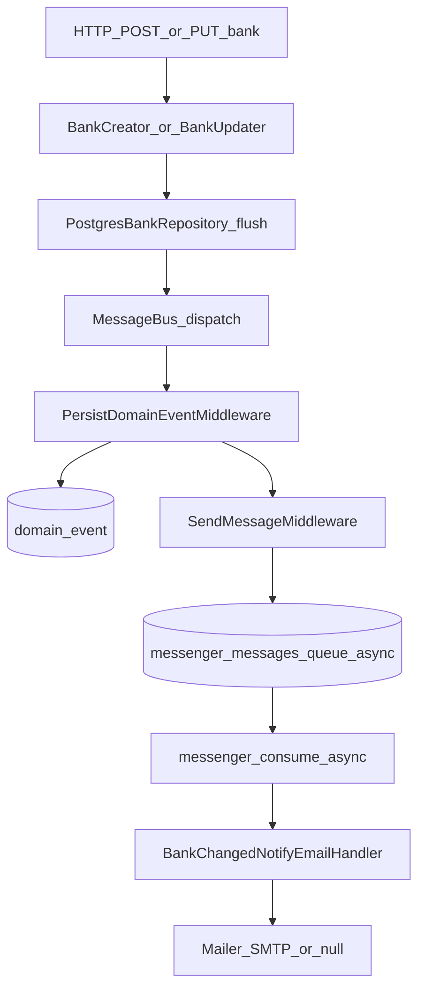
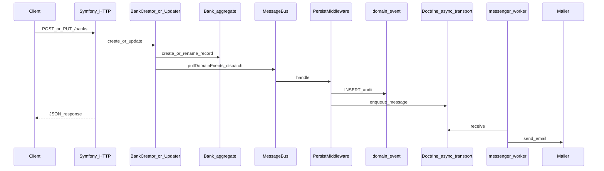

# Domain events, Messenger, and notifications

This document describes how ERPify records **domain events** in PostgreSQL and processes **bank created/updated** notifications asynchronously with **Symfony Messenger** and the **Doctrine transport**. It complements the official [Messenger](https://symfony.com/doc/current/messenger.html) documentation and the event style used in [CodelyTV/php-ddd-example](https://github.com/CodelyTV/php-ddd-example) (immutable events, `eventName()`, `toPrimitives()`).

## What happens on bank create/update

1. **`Bank`** (Doctrine entity extending [`AggregateRoot`](../api/src/Shared/Domain/Aggregate/AggregateRoot.php)) records events inside **`Bank::create`** and **`Bank::rename`** via `record()`. After `save()`, **`BankCreator` / `BankUpdater`** call **`pullDomainEvents()`** and dispatch each event on `MessageBusInterface` (Codely-style separation: domain owns *what* happened, application publishes).
2. **Persist middleware** (`PersistDomainEventMiddleware`) runs **before** messages are sent to transports. It calls **`DomainEventStore::append()`** for every `DomainEvent` subclass. The default implementation is **`DoctrineDomainEventStore`** (rows in **`domain_event`**), registered for autowiring via **`#[AsAlias(DomainEventStore::class)]`**. To use another adapter, move that attribute to your implementation (or define a container alias) so `DomainEventStore` still resolves without changing middleware.
3. **Routing** sends those bank events to the **`async`** transport (Doctrine table `messenger_messages`, logical queue name `async`).
4. The **`messenger_worker`** service consumes the queue and runs **`BankChangedNotifyEmailHandler`** (and any other **`AsMessageHandler`** you add). Bank handlers inject **`NotificationMailer`** (default: **`PlainTextNotificationMailer`**); add more small handlers per domain/event that reuse the port with their own recipients and subjects.

Without a running **`messenger_worker`** (or another consumer using the same queue), HTTP responses still succeed and **audit rows are still written**; only the **email** stays queued in `messenger_messages`.

## Workflow (high level)



## Sequence (request vs worker)



## Configuration

| Variable | Purpose |
|----------|---------|
| `MESSENGER_TRANSPORT_DSN` | Doctrine DB transport; use `doctrine://default?auto_setup=0` with migrations creating `messenger_messages`. Queue name `async` is set in `api/config/packages/messenger.yaml` (`options.queue_name`). |
| `MAILER_DSN` | Mailer transport (e.g. `null://null` locally, real SMTP/API in production). |
| `MAILER_FROM` | `From` address for notification emails (default `noreply@erpify.local` via `services.yaml` default parameter). |
| `DEFAULT_NOTIFICATION_EMAIL` | Recipient for notifications (default `sergio.salcedo.dev@gmail.com` via parameter default). |

Test environment (`APP_ENV=test`): `async` and `failed` use **`in-memory://?serialize=true`** so PHPUnit does not need a worker, while messages still pass through the Messenger serializer (like a real queue). Use `null://null` for mailer in tests if you extend integration coverage.

## Local development

The async consumer is a **Compose service** named **`messenger_worker`**: it is declared in **[`compose.yaml`](../compose.yaml)** (command, env, `depends_on` database + **`php`** so migrations run first) and gets **dev image + `./api` bind mount** from **[`compose.dev.yaml`](../compose.dev.yaml)**. Production fills **image/build** via **[`compose.prod.yaml`](../compose.prod.yaml)**.

1. Copy [`api/.env.example`](../api/.env.example) to `api/.env` and set variables as needed.
2. Run migrations (Docker entrypoint on **`php`** usually runs `doctrine:migrations:migrate` before FrankenPHP listens; the worker waits for **`php`** to be healthy).
3. Start the stack from the repo root so the daemon is included (same files as `make dev-up` / `make up-wait` when using dev overrides):
   - `docker compose -f compose.yaml -f compose.dev.yaml up --wait -d`
4. Tail the consumer: `docker compose -f compose.yaml -f compose.dev.yaml logs -f messenger_worker`.

**API + DB only** (`make api-up-http`) also starts **`messenger_worker`** so queued bank emails are still processed.

Optional one-off consume in the **`php`** container (same codebase as the worker):

```bash
docker compose -f compose.yaml -f compose.dev.yaml exec php php bin/console messenger:consume async -vv
```

Useful debugging:

- `php bin/console debug:messenger`
- `php bin/console messenger:stats` (when the transport supports it)
- `php bin/console messenger:failed:show` (after failures land in `failed` transport)

## Deploy to production

Use the monorepo guide **[`docs/production-deployment.md`](production-deployment.md)** for DNS, TLS, Compose (`compose.yaml` + `compose.prod.yaml`), **`messenger_worker`**, **`MAILER_DSN` / `MAILER_FROM`**, Mercure URLs, CORS, and smoke tests.

Messenger-specific reminders:

- **`MESSENGER_TRANSPORT_DSN`** should stay `doctrine://default?auto_setup=0`; **`domain_event`** and **`messenger_messages`** must exist via **migrations** (not transport auto-setup).
- Run **at least one** `messenger:consume async` process in production (the **`messenger_worker`** service or equivalent). See [Symfony: Deploying Messenger](https://symfony.com/doc/current/messenger.html#deploying-to-production).
- After each deploy, **restart workers** or run **`messenger:stop-workers`** so handlers match the new code.
- Failed messages: **`messenger:failed:show`** / **`retry`** / **`remove`** on the **`failed`** transport.

**Smoke test (bank flow):** create or update a bank, then confirm **`domain_event.name`** is **`erpify.backoffice.bank.created`** or **`erpify.backoffice.bank.updated`** and that mail is delivered (or appears in your provider’s logs).

## Extending

- Add new event classes extending `Erpify\Shared\Domain\Event\DomainEvent`. They are **automatically audited** when dispatched (middleware).  
- To add **async** side effects, register handlers and add **`routing`** entries in `api/config/packages/messenger.yaml` for the new message class.
- For **email notifications**, add a dedicated **`AsMessageHandler`** class under the relevant bounded context (like `BankChangedNotifyEmailHandler`). Inject **`NotificationMailer`**; add a new implementation (e.g. Twig-based) and **`#[AsAlias(NotificationMailer::class)]`** (or a container alias) if you outgrow plain text. Wire **`Autowire` env** for per-topic recipients (e.g. `DEFAULT_NOTIFICATION_EMAIL`, `ORDER_OPS_EMAIL`).

## Code map

| Piece | Location |
|-------|-----------|
| `AggregateRoot` (`record` / `pullDomainEvents`) | `api/src/Shared/Domain/Aggregate/AggregateRoot.php` |
| `DomainEvent` base | `api/src/Shared/Domain/Event/DomainEvent.php` |
| `Bank` aggregate (`create`, `rename`) | `api/src/Backoffice/Bank/Domain/Entity/Bank.php` |
| Bank events | `api/src/Backoffice/Bank/Domain/Event/` |
| Publish pulled events (application) | `api/src/Backoffice/Bank/Application/BankCreator.php`, `BankUpdater.php` |
| Audit entity | `api/src/Shared/Infrastructure/Persistence/Entity/StoredDomainEvent.php` |
| `StoredDomainEventRepository` + `DoctrineStoredDomainEventRepository` | `api/src/Shared/Infrastructure/Persistence/StoredDomainEventRepository.php`, `DoctrineStoredDomainEventRepository.php` |
| `DomainEventStore` (port) + `DoctrineDomainEventStore` | `api/src/Shared/Application/DomainEvent/DomainEventStore.php`, `api/src/Shared/Infrastructure/Persistence/DoctrineDomainEventStore.php` |
| Persist middleware | `api/src/Shared/Infrastructure/Messenger/PersistDomainEventMiddleware.php` |
| `NotificationMailer` (port) + `PlainTextNotificationMailer` | `api/src/Shared/Application/Mailer/NotificationMailer.php`, `api/src/Shared/Infrastructure/Mailer/PlainTextNotificationMailer.php` |
| Bank email handlers | `api/src/Backoffice/Bank/Infrastructure/Messenger/BankChangedNotifyEmailHandler.php` |
| Messenger config | `api/config/packages/messenger.yaml` |
