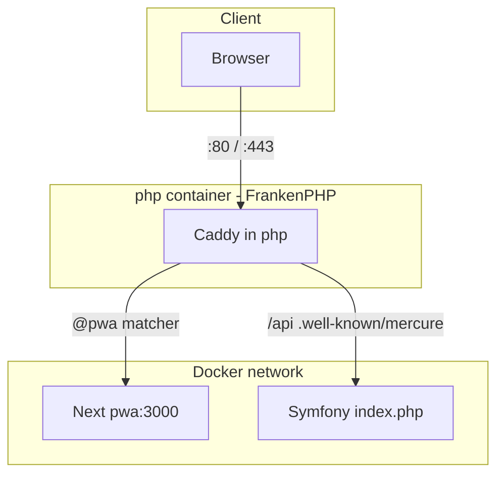

# Local full stack: FrankenPHP, Next.js, and Symfony API

This document describes HTTP traffic when you run the **default Docker stack** from the repo root (`make up-wait` or `docker compose up --wait`). The model matches the [API Platform distribution](https://github.com/api-platform/api-platform): **one public entry** — FrankenPHP/Caddy in the **`php`** container — which **reverse-proxies** HTML and Next assets to **`pwa:3000`** and runs Symfony for **`/api*`** and Mercure.

## Who serves what

| Environment | Public entry | Notes |
|-------------|--------------|--------|
| **Docker default** | **`php`** on host **80** / **443** | No separate edge Caddy container. Next is internal on **3000**. |
| **Local dev (Make)** | Same public entry | Root **`Makefile`** uses **[`compose.dev.yaml`](../compose.dev.yaml)** so **`pwa`** runs **`next dev`** with a bind mount (hot reload). CI uses **`compose.yaml`** + **`compose.dev.yaml`** only (production-style Next). |
| **Production Compose** | Same idea: **`compose.yaml`** + **`compose.prod.yaml`** build **`php`** and **`pwa`**. | Set **`SERVER_NAME`**, secrets, and **`NEXT_PUBLIC_SYMFONY_API_BASE_URL`** for your real host. |

## High-level flow

- **Same origin** for the browser: **`https://localhost`** serves both the UI (via proxy to Next) and **`/api/...`** (Symfony), which keeps CORS and mixed-content simple.
- **`NEXT_PUBLIC_SYMFONY_API_BASE_URL`** should match that origin (e.g. **`https://localhost`** in the default image build).
- **`SYMFONY_INTERNAL_URL`** inside the **`pwa`** container stays **`http://php:80`** for server-side fetches.

## Sequences

### Open the landing page (HTTP)

1. Browser requests **`GET http://localhost/`** with **`Accept: text/html`**.
2. Caddy matches **`@pwa`**, **`reverse_proxy`** to **`pwa:3000`**.
3. Next returns HTML; Caddy returns it to the browser.

### JSON API

1. Browser or client requests **`GET https://localhost/api/v1/health`** (typical **`Accept: application/json`**).
2. **`@pwa`** does not match; request is rewritten to **`index.php`** and handled by Symfony.
3. JSON response passes through FrankenPHP.

### Mercure

Subscriber traffic to **`/.well-known/mercure`** is handled by the **`mercure { }`** block in [`api/frankenphp/Caddyfile`](../api/frankenphp/Caddyfile), not by Next.

## Production (reminder)

- Use real TLS (Let’s Encrypt or your LB) and strong secrets; see [pwa/docs/production-deployment.md](../pwa/docs/production-deployment.md) and [api/docs/production-ready/](../api/docs/production-ready/).
- Set **`CORS_ALLOW_ORIGINS`** in Symfony to your real app origins.
