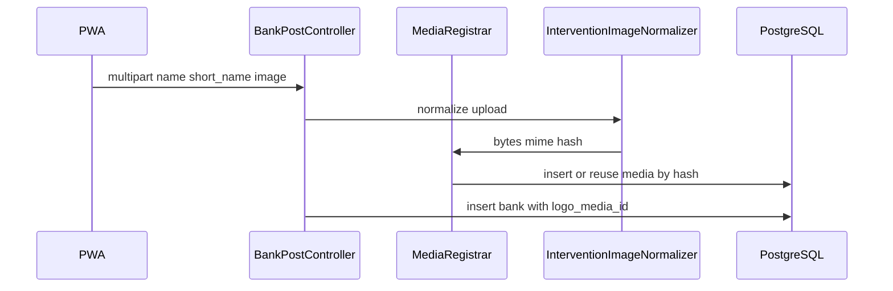
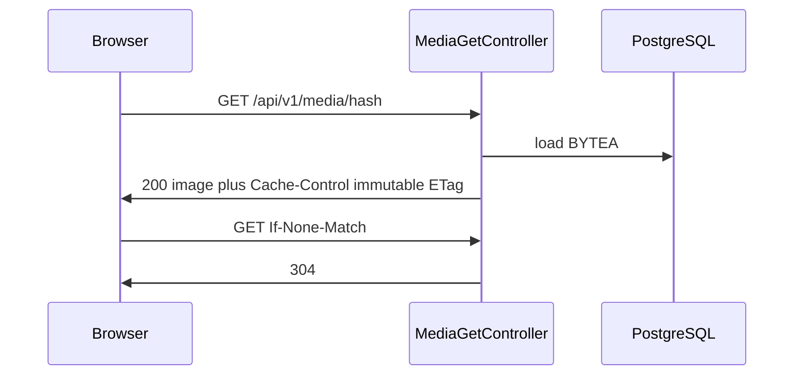

# Media uploads (BYTEA) and bank logos

> **Flysystem / disk storage** for separate bank attachments (`storedObjectUrl`, `GET /api/v1/stored-objects/{hash}`) is documented in **[object-storage.md](object-storage.md)** (configuration, production volumes, deployment checklist).

## Overview

Raster images are normalized server-side (decode, scale down, re-encode, EXIF stripped), fingerprinted with **SHA-256 of the normalized bytes**, and stored in PostgreSQL **BYTEA**. The same bytes always yield the same hash, which enables **deduplication** and **immutable HTTP caching** for delivery.

Bounded context: `Erpify\Shared\Media` under `api/src/Shared/Media/`. `Bank` holds an optional `ManyToOne` to `Media` (logo).

## Upload (backoffice)

- **JSON (unchanged):** `POST /api/v1/backoffice/banks` with `Content-Type: application/json` and body `{ "name": "…", "short_name": "…" }`.
- **Multipart (optional logo):** same path with `multipart/form-data`, fields `name`, `short_name` (or `shortName`), optional file field `image` (JPEG, PNG, or WebP).

Configuration (`api/config/packages/media.yaml`):

- `erpify.media.max_dimension` (default 512 px)
- `erpify.media.max_upload_bytes` (default `2M`)
- `erpify.media.jpeg_quality` / `erpify.media.webp_quality`

Environment:

- `MEDIA_PUBLIC_BASE_URL` — if set, `logoUrl` in JSON is absolute (`{base}/api/v1/media/{hash}`). If empty, the serializer uses the current request to build an absolute URL, or falls back to a path-only `/api/v1/media/{hash}` when no request is available.

## Delivery (frontoffice / public)

- **GET** `/api/v1/media/{hash}` — `hash` is 64 lowercase hex characters (SHA-256 of stored bytes).
- Headers: `Content-Type` from stored mime, `X-Content-Type-Options: nosniff`, `Cache-Control: public, max-age=31536000, immutable`, `ETag` (strong, same as hash), `Content-Length` on 200.
- **304:** send `If-None-Match` with the `ETag` value from a previous response; the handler avoids loading BYTEA when the hash matches and the row is still active.

## JSON shape (banks)

List/detail responses include `logoUrl` (`string` or `null`) when using the `bank:read` serialization group.

## Architecture (mermaid)

## PWA notes

- Use `FormData` and `POST` to `/api/v1/backoffice/banks` with fields `name`, `short_name`, and `image`.
- Prefer **lazy loading** (`loading="lazy"`) and **pagination** for large bank lists; each visible `logoUrl` is a separate cacheable GET.
- Upload byte progress uses the browser (e.g. `XMLHttpRequest.upload`); Mercure is optional for post-processing notifications only.

## Docker

The API image installs the **PHP `gd`** extension (see `api/Dockerfile`) for Intervention Image. Rebuild the `php` service after pulling changes: `docker compose build php`.

## Migrations vs `schema:validate`

The partial unique index `media_content_hash_active_uq` is created in Doctrine migrations only. `doctrine:schema:validate` may report the database as out of sync because the ORM mapping does not declare that partial index. Prefer migrations as the source of truth for this project.

## Swapping storage later

VichUploader is not used for BYTEA. Ports live under `Shared\Media\Application\Port` (`ImageNormalizer`, `MediaPublicUrlGenerator`) with infrastructure implementations you can replace (e.g. object storage) without changing `Bank` rules beyond wiring.
