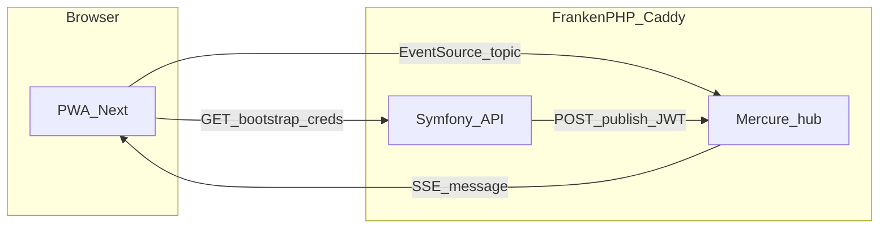
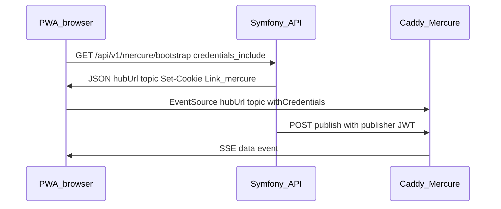

# Mercure real-time updates (ERPify)

This monorepo uses the [Mercure protocol](https://mercure.rocks/) with [Symfony Mercure](https://symfony.com/doc/current/mercure.html): Symfony publishes updates to a **hub** embedded in **FrankenPHP/Caddy**; browsers subscribe with **Server-Sent Events** (`EventSource`).

For HTTP routing (single public entry, `/api` vs `/.well-known/mercure`), see [local-fullstack-traffic.md](local-fullstack-traffic.md).

## Glossary

| Term | Meaning |
|------|---------|
| **Hub** | Server that holds subscriber connections and broadcasts events. Here: Caddy `mercure { }` in [`api/frankenphp/Caddyfile`](../api/frankenphp/Caddyfile). |
| **Topic** | IRI identifying a channel; publishers and subscribers use the same string (e.g. `urn:erpify:mercure:demo`). |
| **Publisher JWT** | Symfony signs this with `MERCURE_JWT_SECRET` so the hub accepts `POST` publishes from the app. |
| **Subscriber JWT** | Optional cookie `mercureAuthorization` so the hub allows private subscriptions; demo uses `Authorization::setCookie()` on bootstrap. |
| **SSE** | Browser `EventSource` long-lived GET to the hub URL with a `topic` query parameter. |

## Environment variables

| Variable | Role |
|----------|------|
| `MERCURE_URL` | URL Symfony uses **internally** to publish (often `http://php/.well-known/mercure` in Compose). |
| `MERCURE_PUBLIC_URL` | URL **browsers** use to open `EventSource` (e.g. `https://localhost/.well-known/mercure` on the default stack). |
| `MERCURE_JWT_SECRET` | Shared HMAC key for JWTs Symfony ↔ hub; must match Caddy/Compose `CADDY_MERCURE_JWT_SECRET`. **Generate per env** (`openssl rand -hex 32`); never commit prod values — [mercure-production-deployment.md](mercure-production-deployment.md). |

Defaults for local files live in [`api/.env`](../api/.env) and [`api/.env.example`](../api/.env.example). Docker Compose overrides these on the `php` service.

## Symfony configuration

- Bundle: `symfony/mercure-bundle` ([`api/config/packages/mercure.yaml`](../api/config/packages/mercure.yaml)).
- Extra JWT claim `subscribe: '*'` is merged from [`api/config/packages/mercure_subscribe.yaml`](../api/config/packages/mercure_subscribe.yaml) so subscriber cookies from `Authorization::setCookie()` work alongside the Flex recipe’s `publish: '*'`.

## API endpoints (demo)

| Method | Path | Description |
|--------|------|-------------|
| `GET` | `/api/v1/mercure/bootstrap` | JSON `{ hubUrl, topic }`, `Link` header (`rel="mercure"`), and Mercure authorization cookie for the demo topic. |
| `POST` | `/api/v1/mercure/publish-demo` | Publishes a JSON payload on the demo topic. **Only when `APP_ENV=dev`** (404 in prod). |

Implementation: [`api/src/Frontoffice/Mercure/`](../api/src/Frontoffice/Mercure/).

## PWA flow

1. `GET /api/v1/mercure/bootstrap` with `credentials: "include"` (see `HttpClient.getWithCredentials`).
2. Build `EventSource(hubUrl + ?topic=..., { withCredentials: true })`.
3. Optional: `POST /api/v1/mercure/publish-demo` in dev to push a test message.

UI: [`MercureDemoPanel`](../pwa/src/context/shared/infrastructure/ui/components/molecules/MercureDemoPanel.tsx) on the landing page.

## CORS

[`api/config/packages/nelmio_cors.php`](../api/config/packages/nelmio_cors.php) enables `allow_credentials: true` for `^/api/v1/mercure/` so the bootstrap response can set cookies when the PWA origin differs (e.g. Next on port 3000).

## Workflow (flowchart)

## Sequence (time order)

## Testing

- **API:** PHPUnit unit tests for `MercurePublishDemoController`; `WebTestCase` for bootstrap (`Link` + cookie + JSON). Run: `php bin/phpunit` (from `api/`).
- **CI:** curl to `/api/v1/mercure/bootstrap` and grep for the demo topic (see [`.github/workflows/ci.yml`](../.github/workflows/ci.yml)).
- **PWA:** Vitest for `BootstrapMercure`; Playwright asserts the Mercure panel leaves the `Idle` state after Connect.

## Production

[mercure-production-deployment.md](mercure-production-deployment.md) covers **generating** `MERCURE_JWT_SECRET`, **leak prevention**, hub hardening, and a **pre-production checklist**.

## Security note

The default Caddyfile enables **anonymous** Mercure subscribers for simpler local demos. Tighten this for production (JWT-only subscribers); see the production doc and [Symfony authorization](https://symfony.com/doc/current/mercure.html#authorization).
