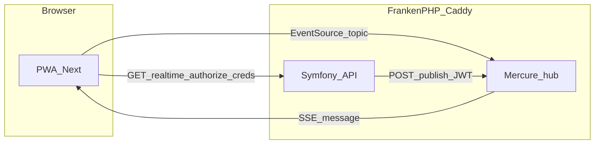

# Mercure real-time updates (ERPify)

This monorepo uses the [Mercure protocol](https://mercure.rocks/) with [Symfony Mercure](https://symfony.com/doc/current/mercure.html): Symfony publishes updates to a **hub** embedded in **FrankenPHP/Caddy**; browsers subscribe with **Server-Sent Events** (`EventSource`).

For HTTP routing (single public entry, `/api` vs `/.well-known/mercure`), see [local-fullstack-traffic.md](local-fullstack-traffic.md).

## Glossary

| Term | Meaning |
|------|---------|
| **Hub** | Server that holds subscriber connections and broadcasts events. Here: Caddy `mercure { }` in [`api/frankenphp/Caddyfile`](../api/frankenphp/Caddyfile). |
| **Topic** | IRI identifying a channel; publishers and subscribers use the same string (e.g. `urn:erpify:backoffice:banks`). |
| **Publisher JWT** | Symfony signs this with `MERCURE_JWT_SECRET` so the hub accepts `POST` publishes from the app. |
| **Subscriber JWT** | Cookie `mercureAuthorization` minted by a per-resource *realtime authorize* endpoint via `Authorization::setCookie()`, so the hub allows a private subscription. |
| **SSE** | Browser `EventSource` long-lived GET to the hub URL with a `topic` query parameter. |

## Environment variables

| Variable | Role |
|----------|------|
| `MERCURE_URL` | URL Symfony uses **internally** to publish (often `http://php/.well-known/mercure` in Compose). |
| `MERCURE_PUBLIC_URL` | URL **browsers** use to open `EventSource` (e.g. `https://localhost/.well-known/mercure` on the default stack). |
| `MERCURE_JWT_SECRET` | Shared HMAC key for JWTs Symfony ↔ hub; must match Caddy/Compose `CADDY_MERCURE_JWT_SECRET`. **Generate per env** (`openssl rand -hex 32`); never commit prod values — [mercure-production-deployment.md](mercure-production-deployment.md). |

Defaults for local files live in [`api/.env`](../api/.env) and [`api/.env.example`](../api/.env.example). Docker Compose overrides these on the `php` service.

## Symfony configuration

- Bundle: `symfony/mercure-bundle` ([`api/config/packages/mercure.yaml`](../api/config/packages/mercure.yaml)).
- Extra JWT claim `subscribe: '*'` is merged from [`api/config/packages/mercure_subscribe.yaml`](../api/config/packages/mercure_subscribe.yaml) so the subscriber cookies from `Authorization::setCookie()` work alongside the Flex recipe's `publish: '*'`.

## Real-time flow

Each realtime-enabled aggregate owns its topic and its authorize endpoint; there is no global demo channel. Using banks as the example (bank accounts mirror it):

1. On a write, Symfony publishes a domain event to the aggregate topic (e.g. `urn:erpify:backoffice:banks`) with the publisher JWT.
2. The PWA calls the resource's `GET .../realtime/authorize` endpoint (`credentials: "include"`), which sets the `mercureAuthorization` subscriber cookie for that topic.
3. The PWA opens `EventSource(MERCURE_PUBLIC_URL + ?topic=..., { withCredentials: true })` — the browser adapter is `BrowserMercureSubscriber` in the PWA.
4. The hub streams the event to every subscriber of the topic.

The controller/adapter wiring lives with each module (`Backoffice/Bank`, `Backoffice/BankAccount`); see [`../docs/architecture-api.md`](../docs/architecture-api.md).

## Workflow (flowchart)

```mermaid
flowchart LR
  subgraph browser [Browser]
    PWA[PWA_Next]
  end
  subgraph edge [FrankenPHP_Caddy]
    API[Symfony_API]
    HUB[Mercure_hub]
  end
  PWA -->|GET_realtime_authorize_creds| API
  PWA -->|EventSource_topic| HUB
  API -->|POST_publish_JWT| HUB
  HUB -->|SSE_message| PWA
```

## CORS

The PWA and the hub are same-origin behind FrankenPHP, so no Mercure-specific CORS carve-out is needed; the general `^/api/` policy in [`api/config/packages/nelmio_cors.php`](../api/config/packages/nelmio_cors.php) applies to the authorize endpoints.

## Production

[mercure-production-deployment.md](mercure-production-deployment.md) covers **generating** `MERCURE_JWT_SECRET`, **leak prevention**, hub hardening, and a **pre-production checklist**.

## Security note

The default Caddyfile enables **anonymous** Mercure subscribers for simpler local development. Tighten this for production (JWT-only subscribers); see the production doc and [Symfony authorization](https://symfony.com/doc/current/mercure.html#authorization).
